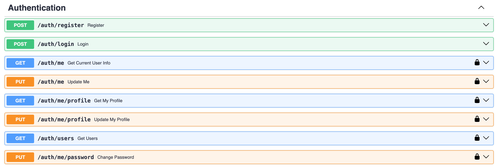
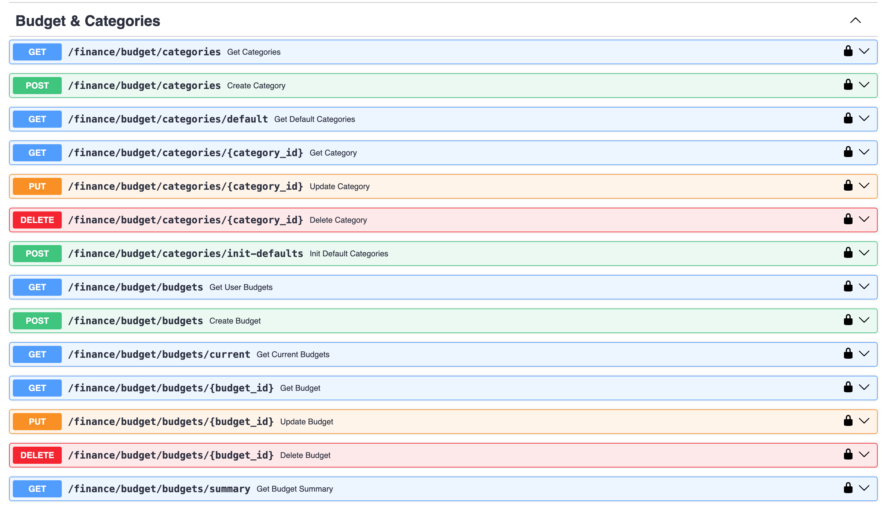
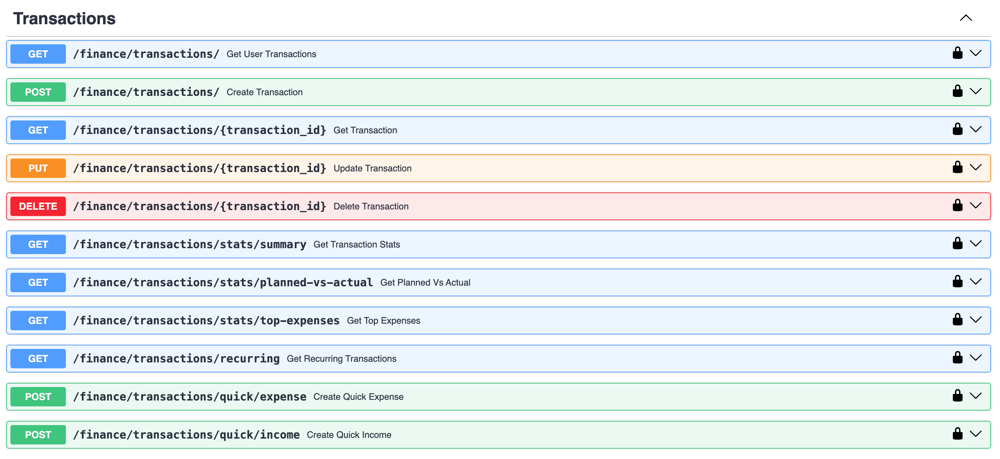
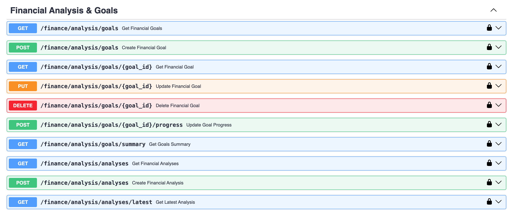
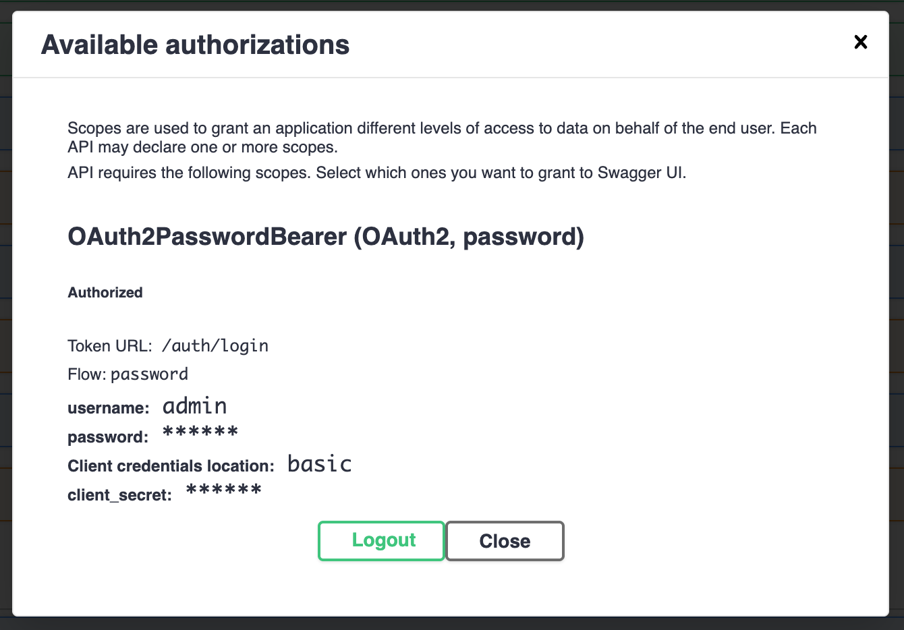
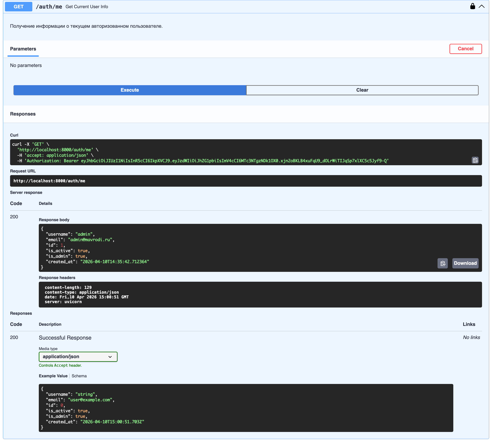
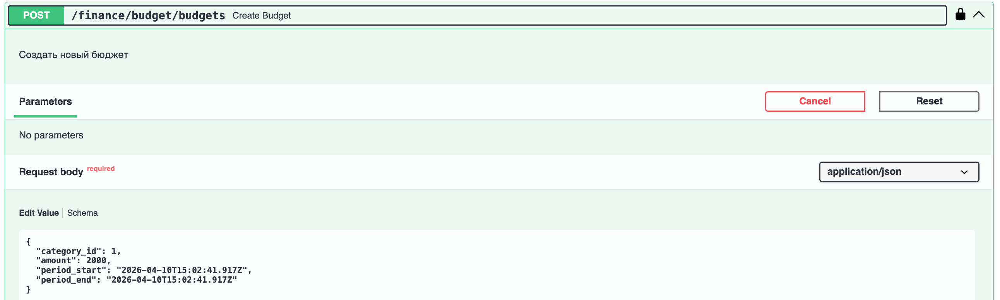
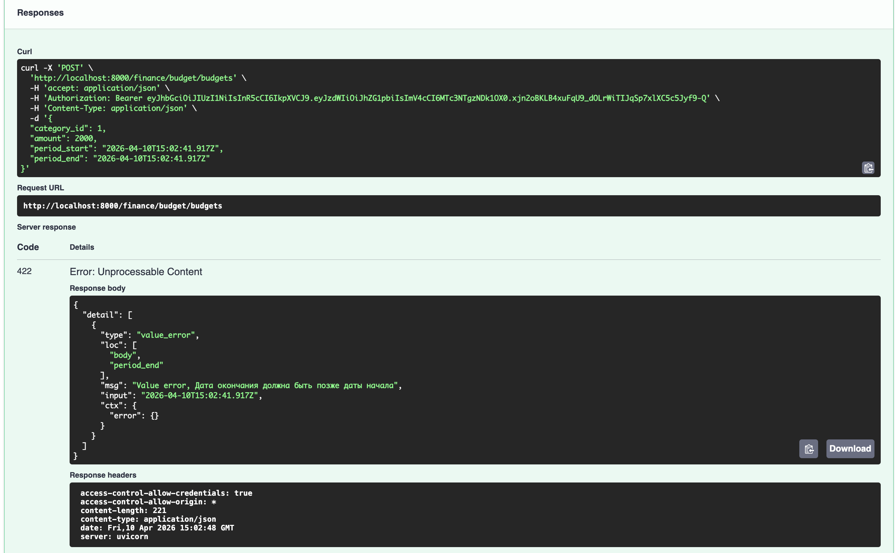
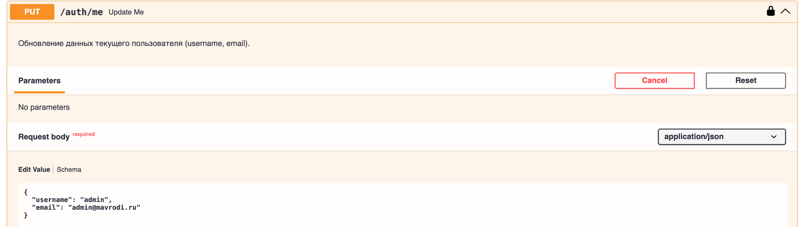
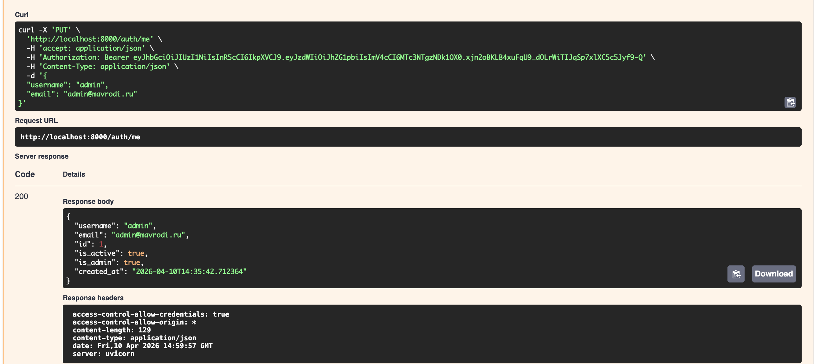

# Лабораторная работа 1. Сервис управления личными финансами

## Цель

Разработать серверное приложение на **FastAPI** для управления личными финансами: учёт доходов и расходов, бюджетирование по категориям, финансовые цели и аналитика. Реализовать аутентификацию пользователей через JWT.

---

## Стек технологий

| Компонент | Технология |
|---|---|
| Фреймворк | FastAPI |
| ORM | SQLAlchemy 2.0 (Mapped, mapped_column) |
| База данных | PostgreSQL 17 |
| Миграции | Alembic |
| Аутентификация | JWT (python-jose) + bcrypt |
| Контейнеризация | Docker + Docker Compose |
| Пакетный менеджер | uv |

---

## Структура проекта

```
app/
├── main.py                  # Точка входа, регистрация роутеров
├── api/
│   ├── routers/
│   │   ├── auth.py          # Регистрация, логин, профиль
│   │   ├── budget.py        # Бюджеты и категории
│   │   ├── transactions.py  # Транзакции
│   │   └── analysis.py      # Финансовые цели и анализ
│   └── schemas/
│       ├── user.py          # Pydantic-схемы пользователя
│       └── finance.py       # Pydantic-схемы финансов
├── core/
│   ├── database.py          # Движок SQLAlchemy, сессия
│   ├── settings/
│   │   ├── config.py        # Настройки приложения
│   │   └── security.py      # JWT, хэширование паролей
│   └── db/
│       ├── models/
│       │   ├── user.py      # Модели User, UserProfile
│       │   └── finance.py   # Модели финансовых сущностей
│       └── crud/
│           ├── user/        # CRUD операции с пользователями
│           └── finance/     # CRUD операции с финансами
alembic/                     # Миграции
docker-compose.yaml
```

---

## Модель данных

### Таблицы

| Таблица | Описание |
|---|---|
| `users` | Пользователи системы |
| `user_profiles` | Профиль пользователя (дата рождения) |
| `categories` | Категории доходов/расходов |
| `budgets` | Бюджеты пользователя по категориям |
| `transactions` | Транзакции (доходы и расходы) |
| `financial_goals` | Финансовые цели |
| `financial_analyses` | Результаты финансового анализа |

### Связи

- **User → UserProfile**: one-to-one
- **User → Budget**: one-to-many (один пользователь — много бюджетов)
- **User → Transaction**: one-to-many
- **User → FinancialGoal**: one-to-many
- **User → FinancialAnalysis**: one-to-many
- **Category → Budget**: one-to-many (одна категория — в нескольких бюджетах)
- **Category → Transaction**: one-to-many

!!! note "Ассоциативная сущность"
    `Budget` связывает `User` и `Category` и содержит собственные поля: `amount`, `period_start`, `period_end`, `is_active` — характеристики самой связи, а не только ссылки.

### Ключевые модели

```python
class Budget(Base):
    __tablename__ = "budgets"

    id: Mapped[int] = mapped_column(Integer, primary_key=True)
    user_id: Mapped[int] = mapped_column(ForeignKey("users.id", ondelete="CASCADE"))
    category_id: Mapped[int] = mapped_column(ForeignKey("categories.id", ondelete="CASCADE"))
    amount: Mapped[Decimal] = mapped_column(Numeric(10, 2))
    period_start: Mapped[datetime] = mapped_column(DateTime)
    period_end: Mapped[datetime] = mapped_column(DateTime)
    is_active: Mapped[bool] = mapped_column(Boolean, default=True)

class Transaction(Base):
    __tablename__ = "transactions"

    id: Mapped[int] = mapped_column(Integer, primary_key=True)
    user_id: Mapped[int] = mapped_column(ForeignKey("users.id", ondelete="CASCADE"))
    category_id: Mapped[int] = mapped_column(ForeignKey("categories.id", ondelete="CASCADE"))
    amount: Mapped[Decimal] = mapped_column(Numeric(10, 2))
    transaction_type: Mapped[TransactionType] = mapped_column(SAEnum(TransactionType))
    description: Mapped[str] = mapped_column(Text)
    is_planned: Mapped[bool] = mapped_column(Boolean, default=False)
    is_recurring: Mapped[bool] = mapped_column(Boolean, default=False)
    transaction_date: Mapped[datetime] = mapped_column(DateTime)
```

---

## API

### Аутентификация (`/auth`)



| Метод | Путь | Описание |
|---|---|---|
| `POST` | `/auth/register` | Регистрация пользователя |
| `POST` | `/auth/login` | Получение JWT-токена |
| `GET` | `/auth/me` | Информация о текущем пользователе |
| `GET` | `/auth/me/profile` | Профиль пользователя |
| `PUT` | `/auth/me/profile` | Обновление профиля |
| `PUT` | `/auth/me` | Обновление данных (username, email) |
| `PUT` | `/auth/me/password` | Смена пароля |
| `GET` | `/auth/users` | Список пользователей (только admin) |

### Бюджеты и категории (`/finance/budget`)



| Метод | Путь | Описание |
|---|---|---|
| `GET` | `/finance/budget/categories` | Список категорий |
| `POST` | `/finance/budget/categories` | Создать категорию (admin) |
| `PUT` | `/finance/budget/categories/{id}` | Обновить категорию (admin) |
| `DELETE` | `/finance/budget/categories/{id}` | Удалить категорию (admin) |
| `GET` | `/finance/budget/budgets` | Бюджеты пользователя |
| `POST` | `/finance/budget/budgets` | Создать бюджет |
| `PUT` | `/finance/budget/budgets/{id}` | Обновить бюджет |
| `DELETE` | `/finance/budget/budgets/{id}` | Удалить бюджет |
| `GET` | `/finance/budget/budgets/summary` | Сводка по бюджетам |

### Транзакции (`/finance/transactions`)



| Метод | Путь | Описание |
|---|---|---|
| `GET` | `/finance/transactions/` | Список транзакций с фильтрацией |
| `POST` | `/finance/transactions/` | Создать транзакцию |
| `GET` | `/finance/transactions/{id}` | Транзакция по ID |
| `PUT` | `/finance/transactions/{id}` | Обновить транзакцию |
| `DELETE` | `/finance/transactions/{id}` | Удалить транзакцию |
| `GET` | `/finance/transactions/stats/summary` | Статистика транзакций |
| `GET` | `/finance/transactions/stats/planned-vs-actual` | Сравнение план/факт |
| `GET` | `/finance/transactions/stats/top-expenses` | Топ расходов |
| `POST` | `/finance/transactions/quick/expense` | Быстрый расход |
| `POST` | `/finance/transactions/quick/income` | Быстрый доход |

### Финансовые цели и анализ (`/finance/analysis`)



| Метод | Путь | Описание |
|---|---|---|
| `GET` | `/finance/analysis/goals` | Финансовые цели |
| `POST` | `/finance/analysis/goals` | Создать цель |
| `PUT` | `/finance/analysis/goals/{id}` | Обновить цель |
| `DELETE` | `/finance/analysis/goals/{id}` | Удалить цель |
| `POST` | `/finance/analysis/goals/{id}/progress` | Пополнить прогресс цели |
| `GET` | `/finance/analysis/analyses` | История анализов |
| `POST` | `/finance/analysis/analyses` | Запустить анализ |

---

## Аутентификация

Реализована вручную без сторонних auth-библиотек.

**Регистрация** — пароль хэшируется через `bcrypt` перед сохранением:

```python
def get_password_hash(password: str) -> str:
    return pwd_context.hash(password)
```

**Логин** — возвращает JWT-токен:

```python
def create_access_token(data: dict, expires_delta: timedelta) -> str:
    to_encode = data.copy()
    expire = datetime.utcnow() + expires_delta
    to_encode.update({"exp": expire})
    return jwt.encode(to_encode, settings.SECRET_KEY, algorithm=settings.ALGORITHM)
```

**Защищённые эндпоинты** — зависимость `get_current_user` декодирует токен из заголовка `Authorization: Bearer <token>` и возвращает текущего пользователя.



---

## Миграции (Alembic)

Настроена асинхронная работа с PostgreSQL. Миграции применяются автоматически при старте контейнера:

```bash
uv run alembic upgrade head
```

Начальная миграция создаёт все таблицы, enum-типы (`categorytype`, `transactiontype`, `analysisstatus`) и индексы.

---

## Примеры работы API

### Получение информации о текущем пользователе



### Создание бюджета

**Запрос:**



**Ответ:**



### Обновление транзакции

**Запрос:**



**Ответ:**



---

## Вывод

В ходе лабораторной работы разработано полноценное REST API приложение на FastAPI для управления личными финансами. Реализованы:

- **7 таблиц** в PostgreSQL через SQLAlchemy ORM с типизированными моделями
- **CRUD-операции** для всех сущностей с вложенными связанными объектами в ответах
- **JWT-аутентификация** с хэшированием паролей (bcrypt), реализованная вручную
- **Система миграций** Alembic с автоматическим применением при запуске
- **Разделение кода** по слоям: модели, схемы, CRUD, роутеры
- **Docker Compose** для запуска приложения с PostgreSQL
